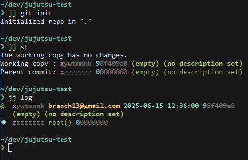
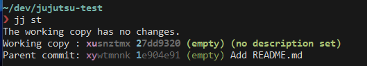
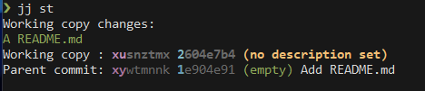
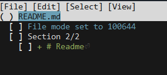
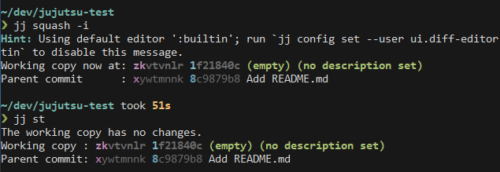
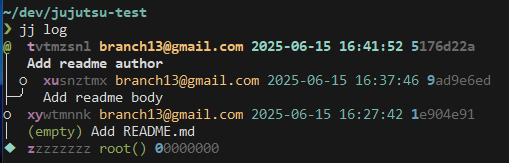
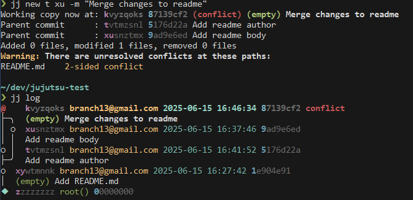
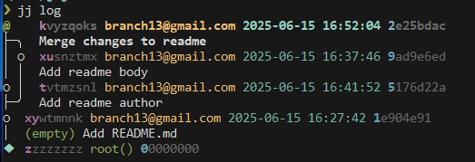
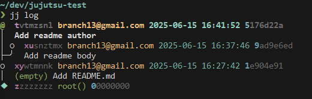
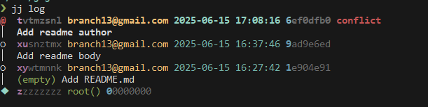

I've decided to try [Jujutsu](https://github.com/jj-vcs/jj) in one of my side projects, as I've been interested in it for a while.

It has an interesting design choice: the working copy is a commit. As a consequence, both the workflow and the internal algorithms are simplified.

In addition there are some other cool features:
- It records every operation and provides an `undo` command
- Automatic rebase
- Conflicts are recorded in commits
- It has a functional language to describe revsets
- It's compatible with git and github

# Initializing the repository

The repository can be inizialized with `jj git init`.

Running `jj log` will show the current status:



The interesting here is that I already have two commits, an empty root one, and our working copy which is also empty at the moment.

Moreover, both commits have two ids: the first one (like `xywtmnnk`) is immutable, while the second one is the usual git's commit hash.
The first letter of the id is highlighted, and I can use just that to reference the commit in our commands.

# Describing the commits
I want to start adding some files, so the first step is setting an appropriate name for our working copy.


The commit hash changed, but the id is still the same one.

# The squash worflow

I could start editing the files and they would already be part of this commit automatically, but I think the squash workflow is much more flexible and interesting.

First I create a new commit with `jj new`.



Then I create a file with some content:

```bash
touch README.md
echo "# Readme" >> README.md
```



And then by running `jj squash -i` I can choose which files (or part of them) I want to add to my actual commit.





# Branching

I'm going to create two different commits branching from `xywtmnk`.

The first commit is not different from what I did already:

```bash
jj describe -m "Add readme body"
jj new
echo "A readme file" >> README.md
jj squash # No need to select via tui
```

Then I create another commit on top of `xywtmnk` by running `jj new xy`, and add some content to it, this time I'm not using the squash workflow:

```bash
jj new xy
jj describe -m "Add readme author"
echo "Written by Dario" >> README.md
```



There are a couple of different options here. I'm going to try first  to create a merge commit, and then I will try rebasing.

## Merging

Merging is just a matter of creating a new commit from the two branches heads with `jj new t xu -m "Merge changes to readme"`.



The conflict is in a commit!

To solve it I can try two different things. The first is editing the merge commit, and this can be done by first calling `jj edit k` to be sure that I'm on that commit, and then editing manually the readme.md file like usually done on git.



A second option is creating a new commit on top to solve the conflict, while leaving the conflicted commit in the history.
In this situation, but in a case where the conflict was just a matter of keeping one version over the other, I could have used `jj resolve` to interactively choose the hunks to keep. 

In this situation the command is `jj new -m "fix merge conflict"`, followed by editing the README.md file to solve the conflict. 

## Rebasing

The first step is to go back in time to before the merge happened.
I can list all the operations with `jj op log`, find the state I want to go back to, and then run `jj op restore 956906e2c302`:



Undos are part of the history, so it's possible to go back to the state of the repo at any moment in time.

`jj rebase` is the command to be used to move commits or whole branches from one location to another.

Since I'm already on `tvtmzsnl`, I can just run `jj rebase -d xu`



I now have a linear history, and a conflict to be solved.

# Amending

If I want to amend commit `xusnztmx`, I first have to move it by using `jj edit xu` or `jj edit @-` and then
use either the squash or the edit workflow to update it.


# Branches and more

In jujutsu all branches are anonymous. There's a feature called `bookmarks` which comes pretty close, and the
biggest difference, from what I could understand, is that they have to be moved manually if new commits are
added on top.
This feels a little annoying, but I think it allows greater control over things.

Bookmarks can also be used to work with remote branches and in the standard PR flow.

I mentioned the functional language to describe revsets earlier. It can be used in almost any command apparently,
with some cool applications like `jj log -r author("Dario Oddenino") & description(readme)` to find all the commits
authored by me and that contain the word readme in the description.

# Aknowledgements

Everything mentioned in this post is covered in much more detail [here](https://steveklabnik.github.io/jujutsu-tutorial).


